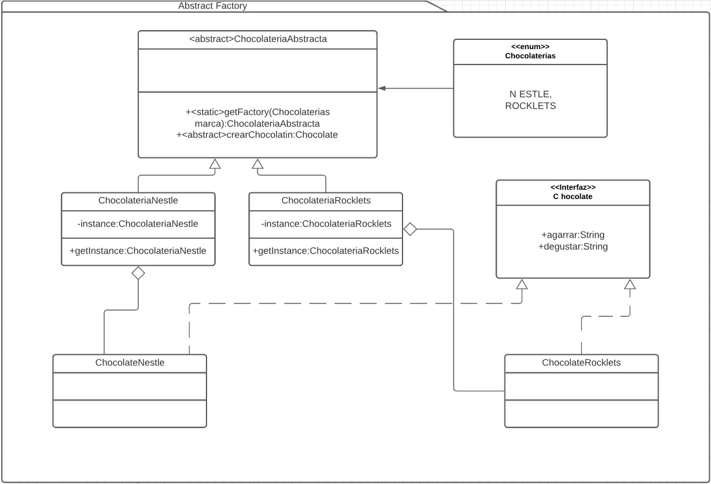

# Abstract Factory
Es un patron creacional. [Link descripcion](https://sourcemaking.com/design_patterns/abstract_factory)

Este patrón se centra en factorias que crean objetos relacionados o de la misma familia. Las factorias se pueden intercambiar entre sí sin afectar el funcionamiento del sistema.

## Diagrama de clases

## SOLID
* Single Responsibility

Al crear la clase abstracta Factory, está tiene la responsabilidad de crear factorias, sin embargo también le estamos dando los métodos de creacion de objetos de las factorias concreatas por lo tanto debe cambiar al implementarse mas factorias y al necesitar más metodos de instancia de objetos, esté principio no se estaría cumpliendo.

* Open/Closed principle

Al aparecer nuevas factorias, el abstract factory debe modificar su método getFactory por lo que este principio se incumple

* Liskov substitution

Cada implementación concreta del abstract factory debe comportarse como la superclase, este principio se cumple

* Interface segregation

La interfaz del abstract factory no tiene por que ser monolitica, este principio se cumple

* Dependency inversion

La superclase AbstractFactory debe conocer las clases concreta de factory que devuelve en su metodo getFactory, por lo que este principio se incumple.
